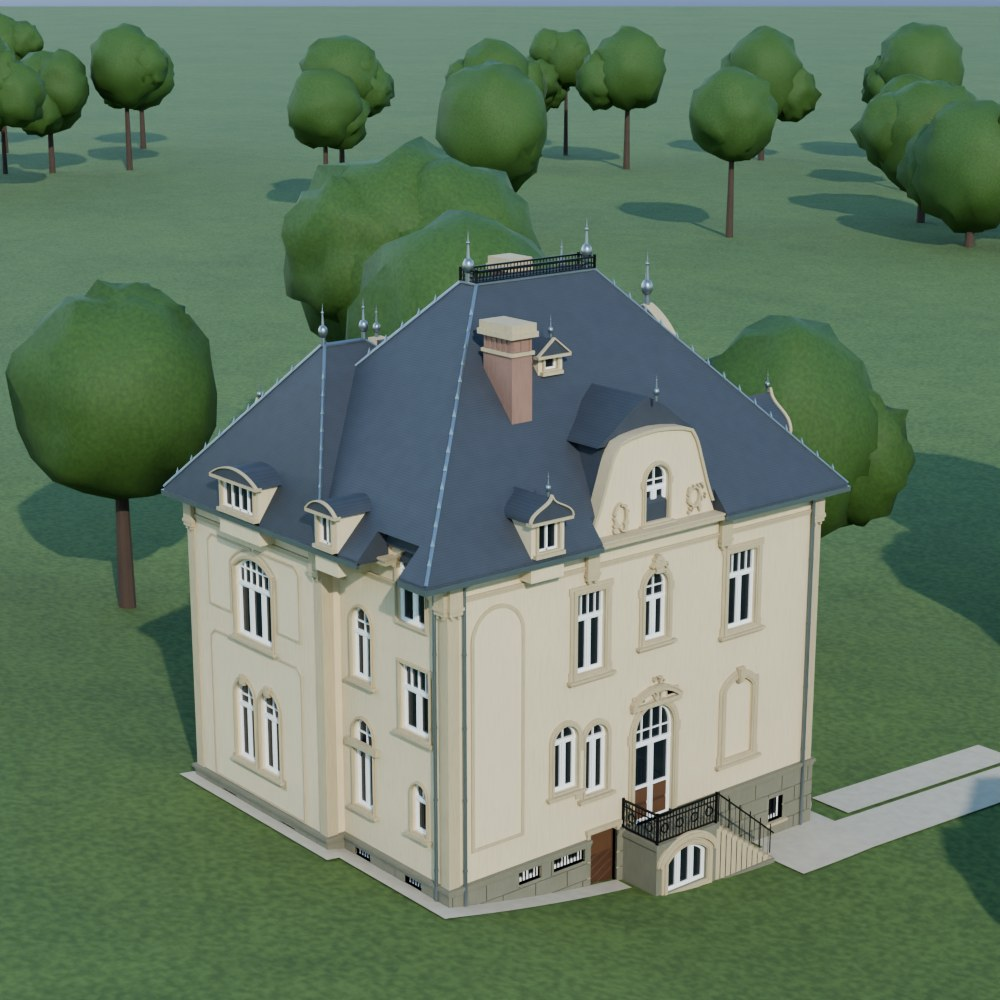

# tennelbach

3D viewer with an AI-assisted reconstruction of an old mansion: the villa in the Tennelbach valley,
Wiesbaden-Sonnenberg, designed in 1904 and later demolished.

**Live viewer:** https://moritzramm.github.io/tennelbach/ (once GitHub Pages is enabled, see below)

## What's in here

| Path | Purpose |
|---|---|
| `index.html` | Web viewer (three.js r128 inlined). Loads the model from `villa_callenberg.glb`. |
| `villa_callenberg.glb` | The 3D model (glTF binary, Y-up, metres, 14 material groups such as plaster, cornices, slate roof, glass, wrought iron). |
| `standalone/villa_callenberg_viewer.html` | Same viewer with the model embedded – works offline by double-click. |
| `preview.jpg` | Path-traced render (Blender Cycles). Trees and lawn are placeholders, not historical. |
| `tools/` | Python scripts that generate the model and the renders (see `tools/README.md`). |

## Viewer features

- Orbit, zoom, pan; preset views (perspective, front, right, back, left); terrain toggle; auto-rotation
- **Licht**: one adjustable light (brightness, direction, height)
- **Kamerafahrt**: one-shot camera flight around the house, rising to about 20 m above the roof; the UI hides during playback, **Esc** (or tapping on touch devices) stops it
- Software rendering fallback when WebGL is unavailable

## Enable GitHub Pages

Settings → Pages → *Build and deployment*: Source **Deploy from a branch**, branch **main**, folder **/ (root)**.
After a minute the viewer is available at `https://moritzramm.github.io/tennelbach/`.

Note: `index.html` fetches the GLB, so it must be served over HTTP(S). Opening it via `file://` will not load the model –
use the standalone file for that.

## How the model was made

- Geometry from the original building permit drawings of September 1904 (scale 1:100): basement, ground floor,
  upper floor and attic plans plus four elevations. The elevations were calibrated against the printed scale bars
  (94.6 px/m) and overlaid pixel-accurately on the model; ornaments were vectorised directly from the elevation linework.
- Colours and some as-built details from historical black-and-white and colour photographs.
- Known deviations and assumptions: heights are measured from the elevations (approx. ±0.3 m); the drawings are partly
  inconsistent with each other; the built state differed from the 1904 design in places (e.g. front gable, dormers);
  the roof platform and the iron ornaments follow the drawings; interiors are not modelled.

## Credits & rights

- three.js r128 (MIT license, header kept in `index.html`).
- The source drawings and photographs are **not** included in this repository. The 1904 drawings are most likely in the
  public domain; rights to the photographs may still exist.
- Choose and add a license for the model and code before reuse (none is set yet).

---

**Deutsch (Kurzfassung):** 3D-Rekonstruktion der abgerissenen Villa im Tennelbach (Wiesbaden-Sonnenberg) nach den
Bauplänen von 1904 und historischen Fotos. Viewer: `index.html` (über GitHub Pages), offline: `standalone/`.
